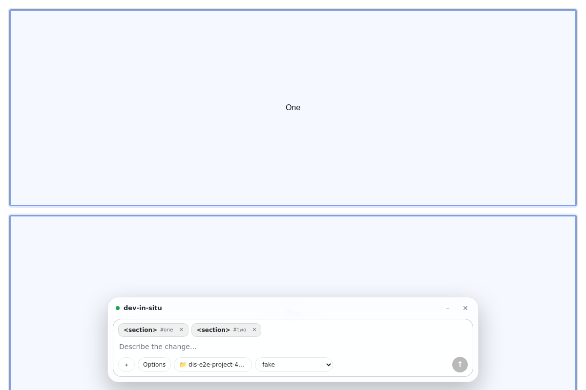

<div align="center">

# dev-in-situ

**Click an element. Describe the change. Your AI coding agent edits the source.**

[](https://github.com/NabilAldhamari/dev-in-situ/actions/workflows/ci.yml)
[](LICENSE)
[](package.json)



</div>

Works with Claude Code, Codex, Gemini CLI, opencode, Antigravity, Kimi, GLM, Ollama models and any CLI you configure.

```
browser extension  ──►  local daemon (127.0.0.1:4141)  ──►  agent CLI in your project folder
```

## Quick start

Requires Node 22+ and an agent CLI on your `PATH` (`claude`, `codex`, `gemini`...).

```bash
git clone https://github.com/NabilAldhamari/dev-in-situ.git && cd dev-in-situ
npm run setup   # install and build
npm start       # start the daemon, prints your token
```

1. In `chrome://extensions`, enable **Developer mode**, click **Load unpacked**, select `extension/dist`. Or use the zip from the [latest release](https://github.com/NabilAldhamari/dev-in-situ/releases/latest).
2. Paste the token in the settings page and click **Save & test**.
3. On any page press **Ctrl+Shift+X** (**⌘+Shift+X** on Mac) and click an element. Hold **Ctrl/⌘** to select several.
4. Pick the project folder (📁), describe the change, press **Enter**.

Replies stream into the chat bar. Pages without hot reload refresh automatically when files change.

## Configuration

Agents live in `~/.dev-in-situ/config.json`, editable from the settings page. Each agent is a **preset** with overrides or a custom **command**.

```json
{
  "defaultAgent": "claude",
  "timeoutMinutes": 30,
  "agents": {
    "claude": { "preset": "claude" },
    "codex": { "preset": "codex", "model": "gpt-5-codex" },
    "kimi": {
      "preset": "claude",
      "model": "kimi-k2-turbo-preview",
      "env": { "ANTHROPIC_BASE_URL": "https://api.moonshot.ai/anthropic", "ANTHROPIC_AUTH_TOKEN": "${KIMI_API_KEY}" }
    },
    "aider": {
      "command": "aider",
      "background": ["--yes-always", "{options}", "--message", "{prompt}"],
      "modelFlag": ["--model", "{model}"]
    }
  }
}
```

Presets: `claude`, `codex`, `gemini`, `opencode`, `antigravity`. Override fields: `command`, `background`, `terminal`, `args`, `model`, `modelFlag`, `env`, `output`, `resumeFlag`, `sessionFlag`, `editFlag`, `bypassFlag`. Placeholders: `{prompt}`, `{options}`, `{model}`, `{session}`, `{cwd}`, `{timeout}`.

Env vars: `DEV_IN_SITU_PORT` (default `4141`), `DEV_IN_SITU_HOME` (default `~/.dev-in-situ`).

## Security

- Listens on `127.0.0.1` only, checks `Host`, accepts only extension origins.
- Every request needs the token in `~/.dev-in-situ/token`.
- Web pages cannot call the daemon or change its config.
- Agents run with `shell: false`; prompts are single arguments.

## Development

```bash
npm run check                    # typecheck, test, build
npm run e2e --prefix extension   # end-to-end test in Chromium
```

See [CONTRIBUTING.md](CONTRIBUTING.md) and [SECURITY.md](SECURITY.md). Licensed under [MIT](LICENSE).
